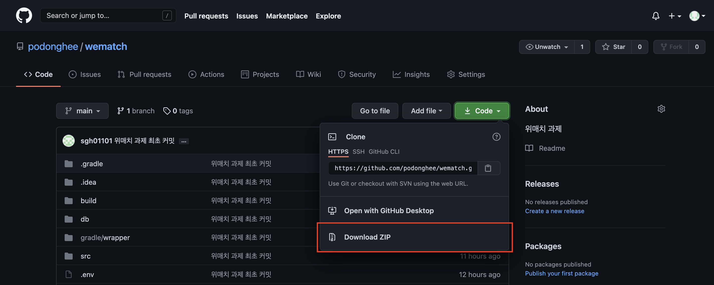
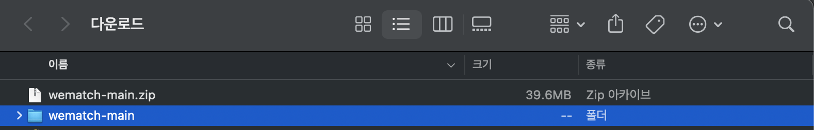
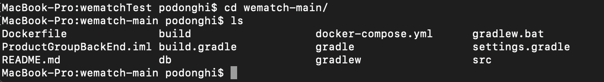
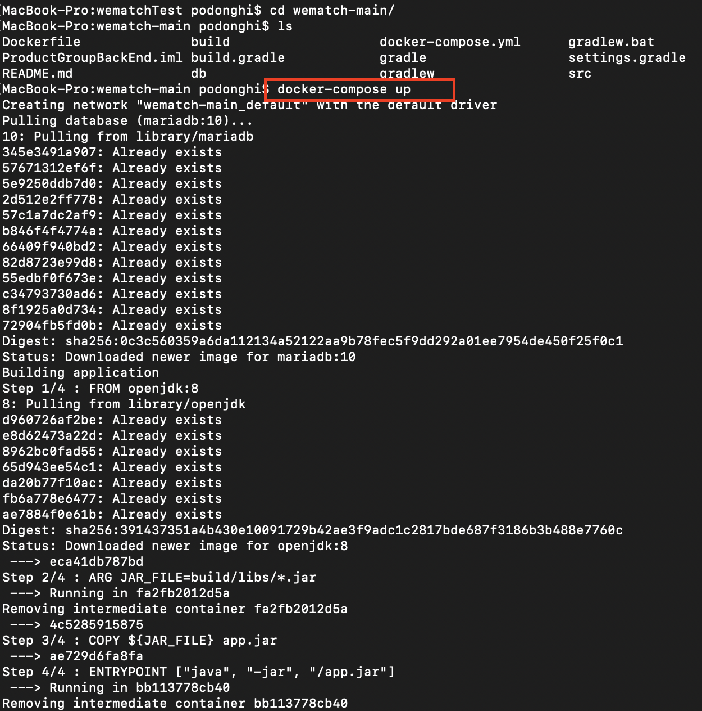
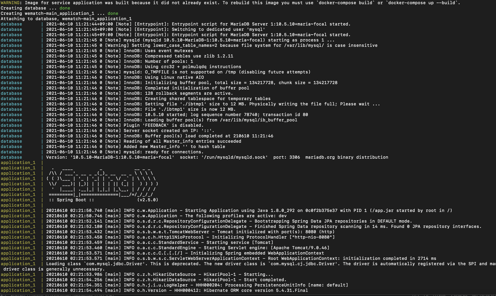
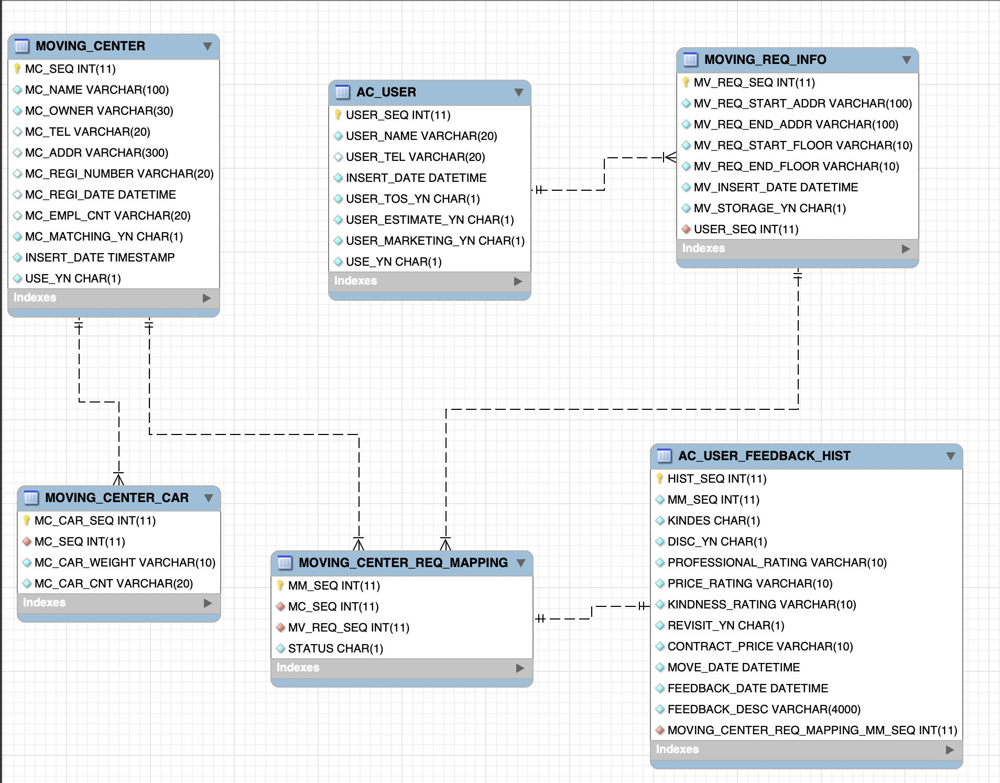

#[위매치] ProductGroup 백엔드팀 과제

###언어 : JAVA 1.8
###프레임워크 : Spring Boot 2.5.0
###DB : 10.5.9-MariaDB

##셋팅법 
1. 밑에 링크 클릭 하여 GitHub 페이지로 이동합니다.
    - GitHub 
    [WeMatch](https://github.com/podonghee/wematch "WeMatch 백앤드 깃 주소") 
      

2. 이미지에 보이는 것 처럼 Code 클릭 Download ZIP 다운을 합니다.

3. 압축을 풀고 원하는 경로로 디렉토리를 이동합니다.

4. 저는 wematchTest 폴더에 넣었습니다. 이미지와 동일하게 프로젝트 경로까지 터미널로 들어갑니다.

5. docker-compose up 실행하시면 mariaDB / java 1.8 / jar 가 순차적으로 실행됩니다. 

##테스트

#### 순차적으로 테이블에 데이터를 넣어주는 API 입니다.  
#### 테스트는 PostMan 툴을 이용하여 진행하였습니다.
1. 이사업체 등록 API  
    - localhost:8080/company/movingCenter

    {
        "mcName": "첫번쨰이사업체",
        "mcOwner" : "첫사장",
        "mcTel": "010-1233-2458",
        "mcAddr" : "서울특별시 서초구 방배로 173 (방배동)",
        "mcRegiNumber" : "101-01-13713",
        "mcRegiDate" : "2021-06-13",
        "mcMatchingYn" : "Y",
        "mcEmplCnt": "100",
        "movingCenterCarList" : [
                                 {
                                    "mcCarWeight" : "1톤",
                                    "mcCarCnt" : "10"
                                 },
                                 {
                                    "mcCarWeight" : "2톤",
                                    "mcCarCnt" : "6"
                                 },
                                 {
                                    "mcCarWeight" : "2.5톤",
                                    "mcCarCnt" : "4"
                                 },
                                 {
                                    "mcCarWeight" : "8톤",
                                    "mcCarCnt" : "1"
                                 }
                             ]
    }

2. 고객 등록 API 
   - localhost:8080/customer/register

     {
        "userName": "김길동",
        "userTel" : "010-2213-5213",
        "userTosYn": "Y",
        "userEstimateYn" : "Y",
        "userMarketingYn" : "Y"
     }

3. 이사신청 API 
   - localhost:8080/moving/reqInfo
        

        {
            "mvReqStartAddr" : "광주시 아구 강남대로 256 (도곡동, 대우양재디오빌)",
            "mvReqEndAddr": "발구시 미구 강남대로 256 (도곡동, 대우양재디오빌)", 
            "mvReqStartFloor" : "3층", 
            "mvReqEndFloor": "4층",
            "mvInsertDate" : "2021.06.03",
            "mvStorageYn" : "Y", 
            "userSeq" : "1"
        }

4. 이사업체와 이사신청간에 맵핑 API 
    - localhost:8080/moving/movingCenterMapping

        {
            "mcSeq" : "1",
            "mvReqSeq" : "1"
        }

5. 유저 피드백 등록 API
    - localhost:8080/feedback/feedBackHist

    {
        "mmSeq" : "1",
        "kindes" : "H", 
        "discYn": "Y",
        "professionalRating" : "3",
        "priceRating" : "1", 
        "kindnessRating" : "2",
        "revisitYn" : "Y",
        "contractPrice" : "1,500,000",
        "moveDate" : "2021-06-23",
        "feedbackDate" : "2021-06-25",
        "feedbackDesc" : "이업체 솔직히 별로예요 마음에 안들고 직원들도 친절하지 않구요.. 돈이 아까운거 같아요. "
    }

#### 조회 API 입니다.

1. 이사업체 List API 입니다. 
   - localhost:8080/company/getMovingCenterList
    

2. 고객 리스트 API 입니다. 
   - localhost:8080/customer/getUserInfo
    

3. 이사 신청 리스트 API 입니다.
   - localhost:8080/moving/getMovingReqInfo
     

     {
        "mvReqSeq" : "1",
        "userSeq" : "1"
     }

## 사용한 패키지

### ERD 

1. 프로젝트 구조 
   - common     공통 함수 처리 모듈
   - company    이사업체 모듈
   - customer   고객 모듈 
   - feedback   피드백 모듈 
   - moving     이사에 관한 모듈 
   

2. 구조에 대한 설명 
   - 이사업체를 등록할때 이사업체에 가지고 있는 트럭 수를 넣기 위해 
   테이블구조를 MOVING_CENTER / MOVING_CENTER_CAR 로 테이블을 생성하였습니다.
     

   - 고객을 등록하는 AC_USER 테이블을 생성하였습니다. 

   - 이사신청을 하기위해 MOVING_REQ_INFO 테이블을 등록하였습니다.
   

   - 고객이 이사신청을 하고 이사업체랑 맵핑을 하기위해 MOVING_CENTER_REQ_MAPPING 
   테이블을 생성하였습니다.  
   간단하게 STATUS 상태를 넣어 STATUS : A = '진행초기' B = '진행중' C = '완료' 형태로 넣었습니다. 
     

   - STATUS 가 C 즉 완료인경우 AC_USER_FEEDBACK_HIST에 사용자가 업체에 대한 피드백을 할 수 있도록 테이블을 구성하였습니다.
     

